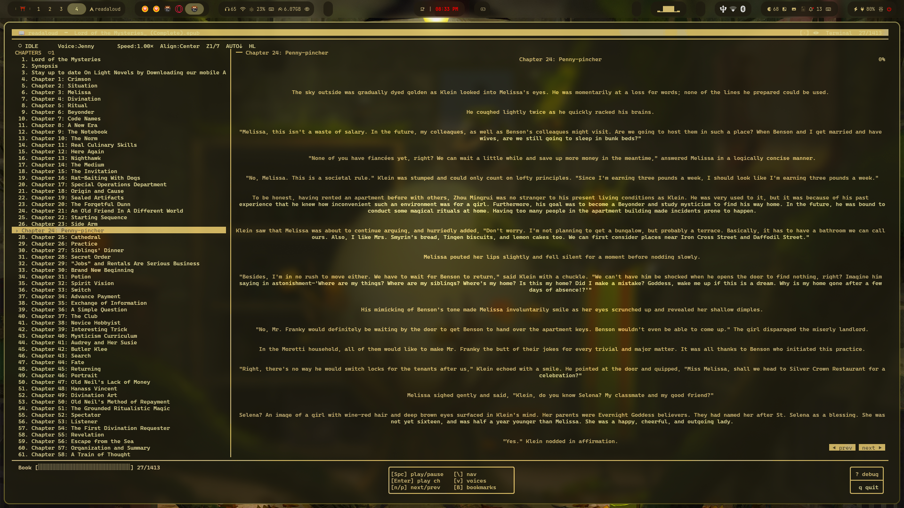
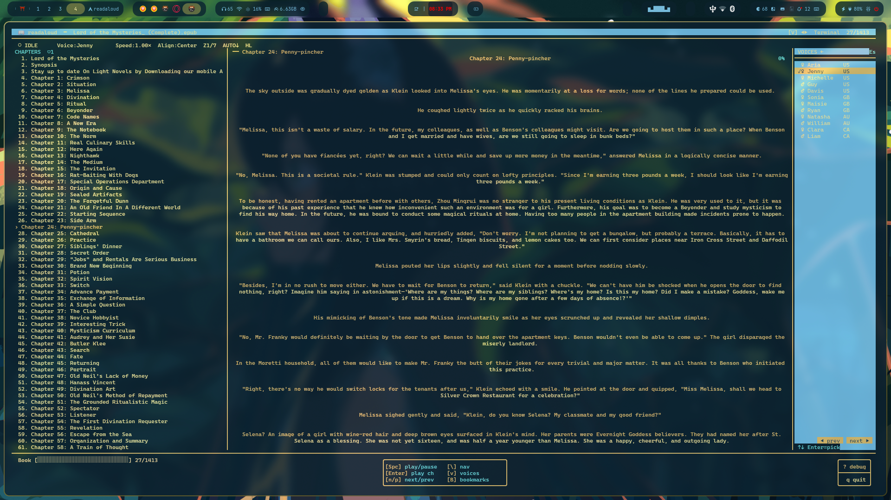
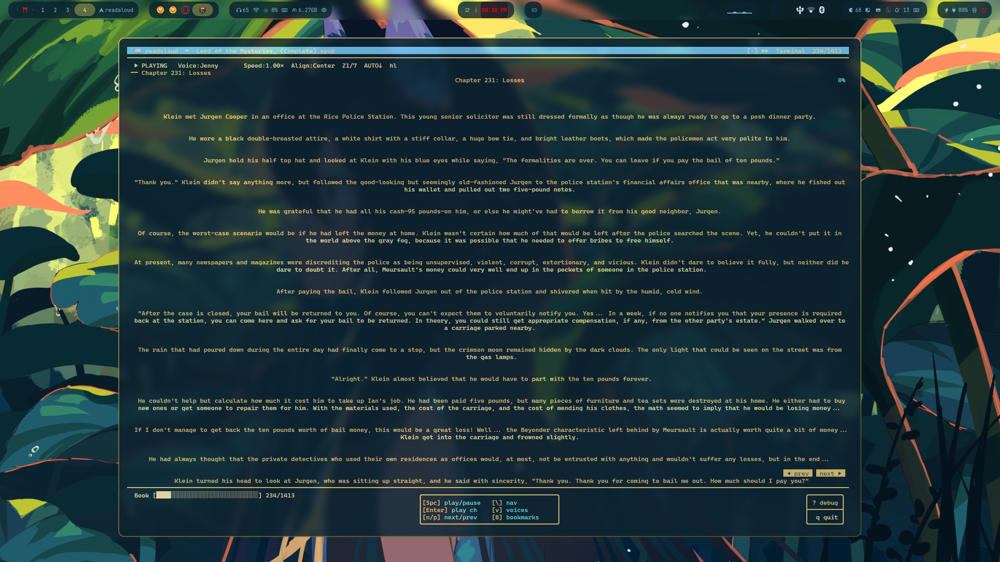

# readaloud

A terminal EPUB/TXT reader with multi-backend neural TTS, built for Linux. No Electron, no browser, no SpeakUB — just a fast curses TUI, natural-sounding voices via online or offline TTS engines, and playback through `ffplay`.

Follows your terminal colour scheme out of the box. Tiling-friendly — resize the window and the layout reflows.

---

## Showcase

**Default layout — chapter nav, reading area, bordered key reference**



**Voices panel open — engine selector and voice list, slides in from the right**



**Tiling with a live wallpaper — transparent terminal, full reflow**



---

## Features

- **Multi-backend TTS** — online (Edge TTS) and offline (Kokoro, Piper, F5-TTS) engines; auto-detected at startup
- **12 Edge TTS voices** — US/GB/AU/CA English via Microsoft's neural API; 7 Kokoro voices included; Piper uses your own ONNX models; F5-TTS clones any voice from a reference WAV
- **EPUB & TXT support** — chapters parsed from spine order; TXT split by headings or blank lines
- **Three-column layout** — chapters left, reading area centre, voices/bookmarks panel right
- **Rice-friendly** — `Terminal` theme uses your kitty/terminal colours as-is; 4 additional themes (Dark Navy, Gruvbox, Nord, Solarized Dark) for 256-colour terminals
- **Tiling-friendly** — layout reflows on any resize; works in any window size ≥50×14
- **Text highlight** — current sentence tracked in sync with playback; toggle on/off with `h`
- **Auto-scroll** — reading area follows playback; toggle with `z`
- **Bookmarks** — add, browse, jump; stored per-file
- **Text zoom** — `Ctrl+scroll` sends kitty OSC font-size sequences for real terminal zoom
- **Variable speed** — 0.75× to 2.0× in 8 steps
- **Text alignment** — left, centre, right
- **Debug overlay** — live player state, engine availability, timing, config dump, log path
- **Persistent config** — all settings, active engine, and bookmarks saved across sessions

---

## TTS Engines

| Engine | Type | Quality | Notes |
|--------|------|---------|-------|
| **Edge TTS** | Online | ★★★★★ | Microsoft neural voices; no API key; needs internet |
| **Kokoro** | Offline | ★★★★☆ | Fast, high-quality CPU inference; best offline choice |
| **Piper** | Offline | ★★★☆☆ | Ultra-lightweight ONNX runtime; drop in `.onnx` model files |
| **F5-TTS** | Offline | ★★★★★ | Flow-matching voice cloner; slow on CPU, GPU recommended |

Engines are auto-detected at startup. Only available engines appear as selectable in the voices panel. The active engine label is always shown in the status bar.

---

## Requirements

### Core (required for all engines)

| Dependency | Purpose | Install |
|---|---|---|
| Python 3.9+ | Runtime | pre-installed on most distros |
| `ebooklib` | EPUB parsing | `pip install --break-system-packages ebooklib` |
| `ffplay` | Audio playback (part of ffmpeg) | `sudo pacman -S ffmpeg` |

### Edge TTS (online, default)

| Dependency | Purpose | Install |
|---|---|---|
| `pipx` | Run `edge-tts` in isolation | `sudo pacman -S python-pipx` |
| `edge-tts` | Microsoft neural TTS | auto-fetched via `pipx run` on first use |

> Requires an internet connection. No API key needed.

### Kokoro (offline)

```bash
pip install --break-system-packages kokoro soundfile
```

### Piper (offline)

```bash
# Install piper binary
pip install --break-system-packages piper-tts

# Download a model (example — en_US-lessac-medium)
mkdir -p ~/.config/readaloud/models
wget -P ~/.config/readaloud/models \
  https://huggingface.co/rhasspy/piper-voices/resolve/main/en/en_US/lessac/medium/en_US-lessac-medium.onnx
```

Any `.onnx` file placed in `~/.config/readaloud/models/` is automatically detected and listed in the voices panel.

### F5-TTS (offline, voice cloning)

```bash
pip install --break-system-packages f5-tts

# Place your reference audio (3–10 seconds of clean speech)
cp your_voice.wav ~/.config/readaloud/voices/ref.wav

# Optional: transcript of the reference clip (improves alignment)
echo "Your reference text here." > ~/.config/readaloud/voices/ref.txt
```

GPU (CUDA) is strongly recommended for F5-TTS; CPU generation is slow but functional.

---

## Distro Quick-Start

### Arch Linux

```bash
sudo pacman -S python-pipx ffmpeg
pip install --break-system-packages ebooklib
```

### Debian / Ubuntu

```bash
sudo apt install pipx ffmpeg
pip install ebooklib
```

### Fedora

```bash
sudo dnf install pipx ffmpeg
pip install ebooklib
```

---

## Installation

```bash
git clone https://github.com/YareyareSenpai/readaloud.git
cd readaloud
chmod +x install.sh && ./install.sh
```

Or manually:

```bash
cp readaloud.py ~/.local/bin/readaloud
chmod +x ~/.local/bin/readaloud
```

Make sure `~/.local/bin` is in your `PATH`:

```bash
echo 'export PATH="$HOME/.local/bin:$PATH"' >> ~/.zshrc
source ~/.zshrc
```

---

## Usage

```bash
readaloud                   # open file browser
readaloud book.epub         # open directly
readaloud chapter.txt       # plain text supported
readaloud book.epub --debug # start with debug overlay
```

---

## Key Bindings

### Playback

| Key | Action |
|-----|--------|
| `Space` | Play / Pause |
| `Enter` | Play selected chapter from start |
| `n` / `p` | Next / previous chapter |
| `s` | Cycle speed (0.75× → 0.9 → 1.0 → 1.1 → 1.25 → 1.5 → 1.75 → 2.0×) |

### Navigation

| Key | Action |
|-----|--------|
| `↑ ↓` | Move chapter list or scroll text (depends on focus) |
| `PgUp / PgDn` | Scroll text by page |
| `Tab` | Cycle focus: chapters → text → right panel |
| `g` | Go to chapter by number |
| `\` | Toggle chapter nav panel |

### Right Panels

| Key | Action |
|-----|--------|
| `v` | Toggle voices panel |
| `B` | Toggle bookmarks panel |
| `b` | Add bookmark at current chapter |
| `Esc` | Close right panel |
| `↑ ↓` (panel focused) | Navigate engine list or voice list |
| `Tab` / `→` (voices panel) | Switch from engine section to voice section |
| `Tab` / `←` (voices panel) | Switch from voice section back to engine section |
| `Enter` (engine focused) | Select active engine |
| `Enter` (voice focused) | Select voice and apply immediately |
| `Enter` (bookmarks focused) | Jump to bookmarked chapter |
| `d` (bookmarks focused) | Delete bookmark |

### Display

| Key | Action |
|-----|--------|
| `a` | Cycle text alignment (left → centre → right) |
| `t` | Cycle theme |
| `h` | Toggle TTS highlight |
| `z` | Toggle auto-scroll |
| `Ctrl + scroll ↑` | Zoom in |
| `Ctrl + scroll ↓` | Zoom out |

### Other

| Key | Action |
|-----|--------|
| `?` | Toggle debug overlay |
| `q` | Quit |

---

## Voices Panel

The voices panel (`v`) has two sub-sections navigated with `Tab` or arrow keys:

**Engine section** — lists all four TTS backends with availability status:
- `✓` marks the currently active engine
- `○` = online engine, `◉` = offline engine
- `✗` suffix = engine not detected / unavailable
- Press `Enter` to switch to the highlighted engine

**Voice section** — lists voices for whichever engine is highlighted in the engine section (even before committing to it, so you can browse):
- `✓` marks the current voice for the active engine
- ♀ / ♂ gender indicators where applicable
- Press `Enter` to activate both the engine and the highlighted voice simultaneously

Switching engine or voice while audio is playing restarts playback from the current chapter with the new settings.

---

## Themes

| Theme | Description |
|-------|-------------|
| `Terminal` | Uses your terminal/kitty colours — default, follows your rice |
| `Dark Navy` | Deep blue-grey |
| `Gruvbox` | Warm retro palette |
| `Nord` | Arctic blue-grey |
| `Solarized Dark` | Ethan Schoonover's classic |

Cycle with `t`. 256-colour terminals get full palette control; 8-colour terminals fall back to Terminal theme.

---

## Available Voices

### Edge TTS (online)

| Name | Region | Gender |
|------|--------|--------|
| Aria | US | ♀ |
| Jenny | US | ♀ |
| Michelle | US | ♀ |
| Guy | US | ♂ |
| Davis | US | ♂ |
| Sonia | GB | ♀ |
| Maisie | GB | ♀ |
| Ryan | GB | ♂ |
| Natasha | AU | ♀ |
| William | AU | ♂ |
| Clara | CA | ♀ |
| Liam | CA | ♂ |

### Kokoro (offline)

| Name | Region | Gender |
|------|--------|--------|
| af_heart | US | ♀ |
| af_bella | US | ♀ |
| af_nicole | US | ♀ |
| am_adam | US | ♂ |
| am_michael | US | ♂ |
| bf_emma | GB | ♀ |
| bm_george | GB | ♂ |

### Piper (offline)

Voices are loaded automatically from any `.onnx` files in `~/.config/readaloud/models/`. The filename stem (e.g. `en_US-lessac-medium`) becomes the voice label. Download models from [rhasspy/piper-voices](https://huggingface.co/rhasspy/piper-voices) on Hugging Face.

### F5-TTS (offline)

Single cloned voice derived from `~/.config/readaloud/voices/ref.wav`. Provide 3–10 seconds of clean, single-speaker audio for best results. An optional `ref.txt` transcript of the clip improves synthesis alignment.

---

## Layout

```
╭─ readaloud ─ book.epub ──────────────────────── [·] ◀▶  Terminal  24/1413 ─╮
│ ▶ PLAYING   [Edge TTS] Jenny         Speed:1.00×  Align:Center  Z1/7  AUTO↓  HL │
├───────────────────────────────────────────────────────────────────────────────────┤
│ CHAPTERS     │  ── Chapter 24: Penny-pincher ──────────────── 0%  │ ENGINES…    │
│  22. Ch 19   │                                                     │ ✓○ Edge TTS │
│  23. Ch 20   │    "Melissa, this isn't a waste of salary..."       │  ◉ Kokoro   │
│ ›24. Ch 24   │                                                     │  ◉ Piper  ✗ │
│  25. Ch 25   │     He coughed lightly twice…                       │  ◉ F5-TTS ✗ │
│  ...         │                                                     │ ── VOICES ──│
├──────────────┴───────────────────────── ◀ prev  next ▶ ───────────┤ ✓♀ Jenny    │
│ Book [████░░░░░░░░░░░░░░░░]  24/1413  ┌─[Spc] play/pause  [\] nav─┐  ♀ Aria     │
│                               │[Enter] play ch   [v] voices│  ♀ Michelle │
│                               │[n/p]  next/prev  [B] bmks  │  …          │
│                               └───────────────────────────┘             │
╰───────────────────────────────────────────────────────────────────────────────────╯
```

---

## Configuration

Stored at `~/.config/readaloud/config.json`. Edited automatically on every settings change.

```json
{
  "voice_index": 1,
  "speed_index": 2,
  "theme": "terminal",
  "align": "center",
  "zoom": 0,
  "engine": "edge-tts",
  "last_file": "/home/user/books/lotm.epub",
  "bookmarks": {
    "Lord of the Mysteries (Complete).epub": [
      { "chapter": 9, "note": "" }
    ]
  }
}
```

Valid `engine` values: `"edge-tts"`, `"kokoro"`, `"piper"`, `"f5-tts"`.

Debug logs: `~/.config/readaloud/debug.log`

---

## How It Works

1. **Parsing** — `ebooklib` reads the EPUB spine and extracts plain text per chapter via a custom HTML stripper. TXT files split by heading patterns or blank lines.
2. **Engine scan** — at startup, `SystemScanner` checks for binary commands (`piper`, `f5-tts_infer-cli`, `ffplay`) and Python imports (`kokoro`, `piper`, `f5_tts`, `edge_tts`) to build an availability map. Unavailable engines are shown greyed out in the voices panel.
3. **TTS** — chapter text is split into ≤4500-char chunks at sentence boundaries, each synthesised by the active backend: Edge TTS writes MP3 via `pipx run edge-tts`; Kokoro uses its Python library or CLI; Piper pipes stdin to its binary with an ONNX model; F5-TTS calls `f5-tts_infer-cli` with `ref.wav`.
4. **Playback** — `ffplay` plays all chunks as a concat playlist with an `atempo` filter for speed control. Pause/resume via `SIGSTOP`/`SIGCONT` on the ffplay process. WAV and MP3 chunks are handled identically by the concat pipeline.
5. **Highlight** — a background thread tracks elapsed time against estimated chars/second (140 wpm × speed × 5 chars/word) to approximate the current reading position.

---

## Troubleshooting

**SSL error from edge-tts**
```bash
SSL_CERT_FILE=/etc/ssl/certs/ca-certificates.crt readaloud book.epub
```

**No audio / ffplay not found**
```bash
sudo pacman -S ffmpeg
```

**ebooklib import error**
```bash
pip install --break-system-packages ebooklib
```

**Kokoro not detected**
```bash
pip install --break-system-packages kokoro soundfile
```

**Piper model not found**
```
Piper requires .onnx model files in ~/.config/readaloud/models/
```
Download from [rhasspy/piper-voices](https://huggingface.co/rhasspy/piper-voices).

**F5-TTS: ref.wav not found**
```bash
cp your_voice_sample.wav ~/.config/readaloud/voices/ref.wav
```

**No chapters found in EPUB**
Some EPUBs have non-standard spine structures. Check `~/.config/readaloud/debug.log`. As a fallback, convert to TXT with Calibre:
```bash
ebook-convert book.epub book.txt
```

---

## Why Not SpeakUB?

SpeakUB's Edge-TTS integration hardcodes `pygame.mixer` for audio output, which fails on Arch Linux with PipeWire. The `tts_backend: mpv` config override isn't actually wired up. `readaloud` owns the full pipeline — TTS generation straight to `ffplay`, no intermediate audio framework — and adds offline engine support on top.

---

## License

MIT
