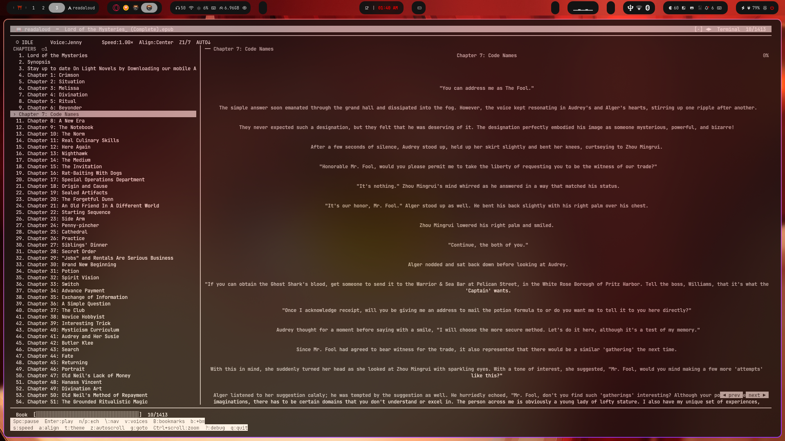

# readaloud

A terminal EPUB/TXT reader with Microsoft Edge neural TTS voices, built for Linux. No Electron, no browser, no SpeakUB — just a fast curses TUI, natural-sounding voices via `edge-tts`, and playback through `ffplay`.



---

## Features

- **Neural TTS voices** — 12 English voices (US/GB/AU/CA) via Microsoft Edge TTS, streamed and played locally
- **EPUB & TXT support** — chapters parsed automatically from spine order; TXT split by headings or blank lines
- **Three-column layout** — chapter navigation on the left, reading area in the centre, voices/bookmarks panel on the right
- **Text highlight** — current sentence highlighted in sync with playback using time-based position tracking
- **Auto-scroll** — reading area follows playback position automatically
- **Bookmarks** — add, browse, and jump to bookmarks; stored per-file in config
- **Text zoom** — `Ctrl+scroll` sends kitty OSC font-size sequences for real terminal zoom, plus adjusts wrap margin
- **5 themes** — Terminal (uses your kitty/terminal colours), Dark Navy, Gruvbox, Nord, Solarized Dark
- **Text alignment** — left, centre, right
- **Variable speed** — 0.75× to 2.0× in 8 steps; speed changes restart chapter at new rate
- **Debug overlay** — live player state, timing, config, last keypress/mouse event, log path
- **Persistent config** — voice, speed, theme, alignment, zoom, bookmarks all saved across sessions

---

## Requirements

| Dependency | Purpose | Install |
|---|---|---|
| Python 3.9+ | Runtime | usually pre-installed |
| `ebooklib` | EPUB parsing | `pip install --break-system-packages ebooklib` |
| `pipx` | Run `edge-tts` in isolation | `sudo pacman -S python-pipx` |
| `edge-tts` | Microsoft neural TTS | auto-fetched via `pipx run` on first use |
| `ffplay` | Audio playback (part of ffmpeg) | `sudo pacman -S ffmpeg` |

> **Note:** `edge-tts` requires an internet connection — it streams synthesis from Microsoft's API. No API key needed.

### Arch Linux (one-liner)

```bash
sudo pacman -S python-pipx ffmpeg
pip install --break-system-packages ebooklib
```

### Debian/Ubuntu

```bash
sudo apt install python3-pip pipx ffmpeg
pip install ebooklib
```

### Fedora

```bash
sudo dnf install pipx ffmpeg
pip install ebooklib
```

---

## Installation

```bash
# Clone
git clone https://github.com/yourusername/readaloud.git
cd readaloud

# Install to PATH
cp readaloud ~/.local/bin/readaloud
chmod +x ~/.local/bin/readaloud

# Make sure ~/.local/bin is in your PATH
echo 'export PATH="$HOME/.local/bin:$PATH"' >> ~/.bashrc   # or ~/.zshrc
source ~/.bashrc
```

---

## Usage

```bash
readaloud                          # open file browser
readaloud book.epub                # open directly
readaloud chapter.txt              # works with plain text too
readaloud book.epub --debug        # start with debug overlay active
```

---

## Key Bindings

### Playback

| Key | Action |
|-----|--------|
| `Space` | Play / Pause |
| `Enter` | Play selected chapter from start |
| `n` | Next chapter |
| `p` | Previous chapter |
| `s` | Cycle speed (0.75× → 0.9 → 1.0 → 1.1 → 1.25 → 1.5 → 1.75 → 2.0×) |

### Navigation

| Key | Action |
|-----|--------|
| `↑ ↓` | Move through chapter list or scroll text (depends on focus) |
| `PgUp / PgDn` | Scroll text by page |
| `Tab` | Cycle focus: chapters → text → right panel |
| `g` | Go to chapter by number (inline prompt) |
| `\` | Toggle chapter navigation panel |

### Right Panels

| Key | Action |
|-----|--------|
| `v` | Toggle voices panel (right side) |
| `B` | Toggle bookmarks panel (right side) |
| `b` | Add bookmark at current chapter |
| `Esc` | Close right panel, return focus to text |
| `↑ ↓` (panel focused) | Navigate list |
| `Enter` (panel focused) | Select voice / jump to bookmark |
| `d` (bookmarks focused) | Delete selected bookmark |

### Display

| Key | Action |
|-----|--------|
| `a` | Cycle text alignment (left → centre → right) |
| `t` | Cycle theme (Terminal → Dark Navy → Gruvbox → Nord → Solarized) |
| `z` | Toggle auto-scroll |
| `Ctrl + scroll ↑` | Zoom in (kitty font size + wrap margin) |
| `Ctrl + scroll ↓` | Zoom out |

### Other

| Key | Action |
|-----|--------|
| `?` | Toggle debug overlay |
| `q` | Quit |

---

## Layout

```
╭─ readaloud ─ Lord of the Mysteries.epub ──────────────────────────── [·] ◀▶  Terminal  7/1413 ─╮
│ ○ IDLE      Voice:Jenny     Speed:1.00×  Align:Center  Z1/7  AUTO↓                             │
├──────────────────────────────────────────────────────────────────────────────────────────────────┤
│ CHAPTERS ♥1  │ ── Chapter 7: Code Names ─────────────────────────── │ VOICES          ←        │
│  1. Prologue │                                                        │ ✓♀ Aria    US             │
│  2. Synopsis │   "You can address me as The Fool."                   │  ♀ Jenny   US             │
│ ›10. Ch 7    │                                                        │  ♀ Michelle US            │
│  11. Ch 8    │    They never expected such a designation...           │  ♂ Guy     US             │
│  ...         │                                                        │  ♂ Davis   US             │
├──────────────────────────────────────────────────────────────────────┤  ...                     │
│ Book [████████░░░░░░░░░░░░░░░░░░░░░░░░░░]  ch 10/1413               │ ↑↓ Enter=pick            │
│ Spc:pause  Enter:play  n/p:±ch  \:nav  v:voices  B:bookmarks  b:+bm │                          │
│ s:speed  a:align  t:theme  z:autoscroll  g:goto  Ctrl+scroll:zoom  ? │                          │
╰──────────────────────────────────────────────────────────────────────────────────────────────────╯
```

---

## Configuration

Config and bookmarks are stored at `~/.config/readaloud/config.json`. Edited automatically — no need to touch it manually.

```json
{
  "voice_index": 1,
  "speed_index": 2,
  "theme": "terminal",
  "align": "center",
  "zoom": 0,
  "last_file": "/home/user/books/lotm.epub",
  "bookmarks": {
    "Lord of the Mysteries.epub": [
      { "chapter": 9, "note": "" }
    ]
  }
}
```

Debug logs are written to `~/.config/readaloud/debug.log` continuously (player events, errors, voice changes).

---

## Available Voices

| Name | Region | Gender |
|------|--------|--------|
| Aria | US | ♀ |
| Jenny | US | ♀ |
| Michelle | US | ♀ |
| Guy | US | ♂ |
| Davis | US | ♂ |
| Sonia | GB | ♀ |
| Maisie | GB | ♀ |
| Ryan | GB | ♂ |
| Natasha | AU | ♀ |
| William | AU | ♂ |
| Clara | CA | ♀ |
| Liam | CA | ♂ |

---

## How It Works

1. **Parsing** — `ebooklib` reads the EPUB spine and extracts plain text per chapter via a custom HTML stripper. TXT files are split by heading patterns or blank lines.
2. **TTS** — chapter text is split into ≤4500-character chunks at sentence boundaries, then each chunk is passed to `pipx run edge-tts` which streams synthesis from Microsoft's servers and writes MP3 files to a temp directory.
3. **Playback** — `ffplay` plays all chunks as a concat playlist with an `atempo` filter for speed control. Pause/resume is done via `SIGSTOP`/`SIGCONT` on the ffplay process.
4. **Highlight** — a background thread tracks elapsed time against an estimated chars/second rate (140wpm × speed × 5 chars/word) to approximate the current reading position.

---

## Troubleshooting

**`edge-tts` SSL error**
```bash
# Usually a missing CA bundle; try:
SSL_CERT_FILE=/etc/ssl/certs/ca-certificates.crt readaloud book.epub
```

**No audio / ffplay not found**
```bash
sudo pacman -S ffmpeg    # Arch
sudo apt install ffmpeg  # Debian/Ubuntu
```

**`ebooklib` import error**
```bash
pip install --break-system-packages ebooklib
```

**EPUB shows no chapters**
Some EPUBs have non-standard spine structures. Check `~/.config/readaloud/debug.log` for parse details. TXT files always work as a fallback — extract with Calibre: `ebook-convert book.epub book.txt`

**Terminal too small**
Minimum size is 50 columns × 14 rows. Recommended 120×35+.

---

## Why Not SpeakUB / Other Tools?

SpeakUB's Edge-TTS integration hard-codes `pygame.mixer` for audio output, which fails on Arch Linux (SDL audio driver conflicts with PipeWire). The `tts_backend: mpv` config override is not actually wired up in the code. `readaloud` bypasses all of that — it owns the full pipeline from TTS generation to playback with no intermediate audio framework.

---

## License

MIT — do whatever you want with it.
